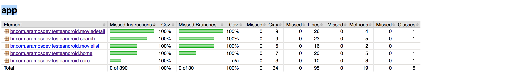

# **Teste Android**
Use The Movie DB API to create a simple Android Client
https://www.themoviedb.org/documentation/api

----

**Run automatic tests**

 - In the Project window, right-click a test and click Run.
 - In the Code Editor, right-click a class or method in the test file and click Run  to test all methods in the class.
 - To run all tests, right-click on the test directory and click Run tests .

----

**Run code coverage report**

 To generate the Jacoco report, execution the command line:
 ```
 ./gradlew -i clean testDebugUnitTestCoverage
 ```
The Jacoco generate this report in path **app/app/build/reports/jacoco**

<p align="center">
  
</p>

----

**Build and Run the application**

 - To build a debug APK, open a command line and navigate to the root of your project directory,To initiate a debug build, invoke the assembleDebug task:
  ```
 ./gradlew assembleDebug
 ```
 - To start the application with all recent changes, click Run (or Debug) in Android Studio.
